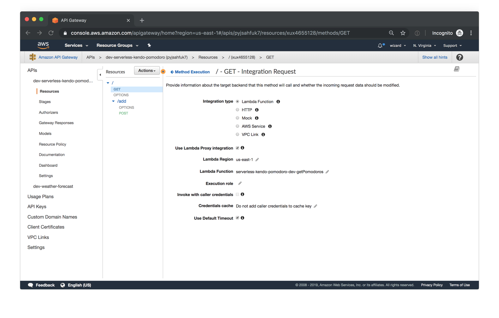

# AWS API

## What is Amazon API Gateway?

Amazon API Gateway is a managed service that allows developers to define the HTTP endpoints of a REST API or a WebSocket API and connect those endpoints with the corresponding backend business logic. It also handles authentication, access control, monitoring, and tracing of API requests.

## Why is Amazon API Gateway an important part of the Serverless ecosystem?

Within the Serverless ecosystem, API Gateway is the piece that ties together Serverless functions and API definitions. Being able to trigger the execution of a Serverless function directly in response to an HTTP request is the key reason why API Gateway is so valuable in Serverless setups: it enables a truly serverless architecture for web applications. When using API Gateway together with other AWS services, it’s possible to build a fully functional customer-facing web application without maintaining a single server yourself.

## How does API Gateway integrate with other AWS services?

Many AWS services support integration with Amazon API Gateway, including:

- AWS Lambda: run Lambda functions to generate HTTP API responses.
- AWS SNS: publish SNS notifications when an HTTP API endpoint is accessed.
- Amazon Cognito: provide authentication and authorization for your HTTP APIs.

API Gateway supports direct integrations that can be configured in the API Gateway user interface (or via the API Gateway’s own API) for the following actions:

- Invoking an AWS Lambda function.
- Invoking another HTTP endpoint, with or without VPC Link.
- Making an HTTP call against the API of any AWS service that provides an HTTP API.
- Returning a mock response generated within API Gateway without calling out to other services.

## What are the some benefits of using Amazon API Gateway?

- Efficient API development : Run multiple versions of the same API simultaneously with API Gateway, allowing you to quickly iterate, test, and release new versions. You pay for calls made to your APIs and data transfer out and there are no minimum fees or upfront commitments.

- Performance at any scale : Provide end users with the lowest possible latency for API requests and responses by taking advantage of our global network of edge locations using Amazon CloudFront. Throttle traffic and authorize API calls to ensure that backend operations withstand traffic spikes and backend systems are not unnecessarily called.

- Cost savings at scale : API Gateway provides a tiered pricing model for API requests. With an API Requests price as low as $0.90 per million requests at the highest tier, you can decrease your costs as your API usage increases per region across your AWS accounts.

- Easy monitoring : Monitor performance metrics and information on API calls, data latency, and error rates from the API Gateway dashboard, which allows you to visually monitor calls to your services using Amazon CloudWatch.

- Flexible security controls : Authorize access to your APIs with AWS Identity and Access Management (IAM) and Amazon Cognito. If you use OAuth tokens, API Gateway offers native OIDC and OAuth2 support. To support custom authorization requirements, you can execute a Lambda authorizer from AWS Lambda.

- RESTful API options : Create RESTful APIs using HTTP APIs or REST APIs. HTTP APIs are the best way to build APIs for a majority of use cases—they're up to 71% cheaper than REST APIs. If your use case requires API proxy functionality and management features in a single solution, you can use REST APIs.

## What two API types might you choose from?

1. RESTful APIs : Build RESTful APIs optimized for serverless workloads and HTTP backends using HTTP APIs. HTTP APIs are the best choice for building APIs that only require API proxy functionality. If your APIs require API proxy functionality and API management features in a single solution, API Gateway also offers REST APIs.

2. WEBSOCKET APIs : Build real-time two-way communication applications, such as chat apps and streaming dashboards, with WebSocket APIs. API Gateway maintains a persistent connection to handle message transfer between your backend service and your clients.

## What is DynamoDB?

DynamoDB is a hosted NoSQL database offered by Amazon Web Services (AWS).It offers:

- reliable performance even as it scales;
- a managed experience, so you won't be SSH-ing into servers to upgrade the crypto libraries;
- a small, simple API allowing for simple key-value access as well as more advanced query patterns.

## How DynamoDB works

## What is Dynamoose?

Dynamoose is a modeling tool for Amazon's DynamoDB. Dynamoose is heavily inspired by Mongoose, which means if you are coming from Mongoose the syntax will be very familar.

## What are some key features of Dynamoose?

- Type safety
- High level API
- Easy to use syntax
- Ability to transform data before saving or retrieving documents
- Strict data modeling (validation, required attributes, and more)
- Support for DynamoDB Transactions
- Powerful Conditional/Filtering Support
- Callback & Promise support
- Edit this page
