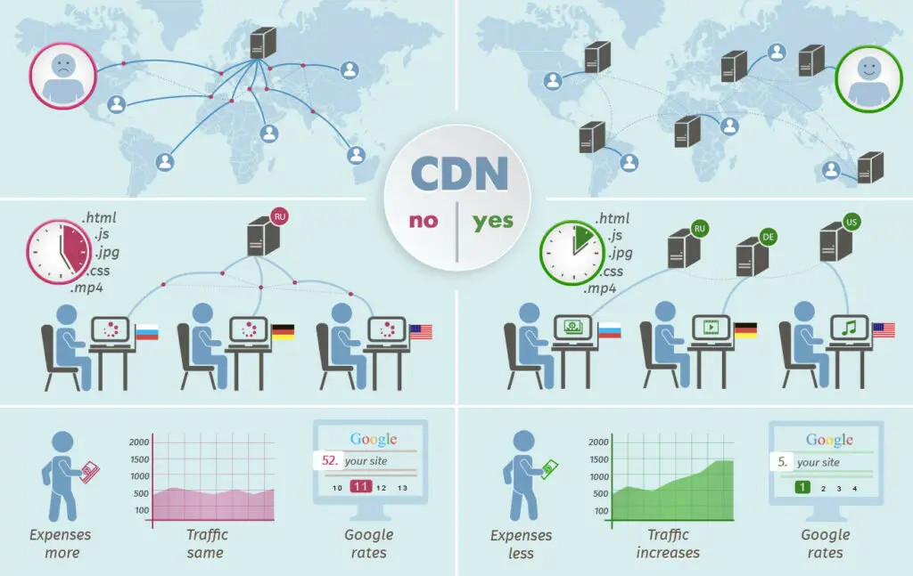

# AWS - S3

## What is Amazon S3?

Amazon Simple Storage Service (Amazon S3) is an object storage service offering industry-leading scalability, data availability, security, and performance. Customers of all sizes and industries can store and protect any amount of data for virtually any use case, such as data lakes, cloud-native applications, and mobile apps. With cost-effective storage classes and easy-to-use management features, you can optimize costs, organize data, and configure fine-tuned access controls to meet specific business, organizational, and compliance requirements.

## some use cases for Amazon S3 :-

1. Build a data lake : Run big data analytics, artificial intelligence (AI), machine learning (ML), and high performance computing (HPC) applications to unlock data insights.

2. Back up and restore critical data : Meet Recovery Time Objectives (RTO), Recovery Point Objectives (RPO), and compliance requirements with S3’s robust replication features.

3. Archive data at the lowest cost : Move data archives to the Amazon S3 Glacier storage classes to lower costs, eliminate operational complexities, and gain new insights.

4. Run cloud-native applications : Build fast, powerful mobile and web-based cloud-native apps that scale automatically in a highly available configuration.

## some benefits of using Amazon S3:-

- Rliable Security.
- All-time Availability.
- Very Low cost.
- Ease of Migration.
- The Simplicity of Management.

---

## What is AWS Lambda?

AWS Lambda is a serverless computing service provided by Amazon Web Services (AWS). Users of AWS Lambda create functions, self-contained applications written in one of the supported languages and runtimes, and upload them to AWS Lambda, which executes those functions in an efficient and flexible manner.

## some use cases for AWS Lambdas:-

1. it these criteria are : Scalable APIs.
2. Data processing.

---

## What is a CDN?

 Content Delivery Network (CDN) is a geographically distributed group of servers that work together to provide fast delivery of Internet content. A CDN allows for the fast transfer of data needed for loading Internet content including HTML pages, javascript files, stylesheets, images, and videos.

 

## How does a CDN work with relation to the website visitor?

CDNs work through servers nearest to the website visitor respond to the request. The content delivery network copies the pages of a website to a network of servers that are spread out at geographically different locations, caching the contents of the page. When a user requests a webpage that is part of a content delivery network, the CDN will redirect the request from the originating site’s server to a server in the CDN that is closest to the user and deliver the cached content. CDNs will also communicate with the originating server to deliver any content that has not been previously cached. In turn, the speed is improved by distributing content closer to the website visitors by using a nearby CDN server, causing visitors to experience faster page loading times. In simpler terms, for example, instead of a user in London trying to access a server in LA, which can cause slower Internet speeds, the user would be redirected through a CDN that is geographically closest to them (London, Paris, Stockholm, etc). As of today, the majority of web traffic goes through through CDNs, including traffic from major sites like Facebook, Netflix, and Amazon.

- Employing a CDN doesn’t only speed up the delivery of Internet content, it helps protect your website against certain forms of cyber attacks, such as Denial of Service attacks. It protects against these threats because CDNs allow for the handling of more traffic and withstanding hardware failure better than many origin servers.

## What are the benefits of employing a CDN?

- Decrease Server Load.
- Improve Site Speed and Website Performance.
- Allow Audience Segmentation Based on User Analytics.
- Reduce Packet Loss and Lower Network Latency.
- Enable Advanced Website Security.
- Enhance Content Availability.
- Contribute to Cost Savings by Reducing Bandwidth.
