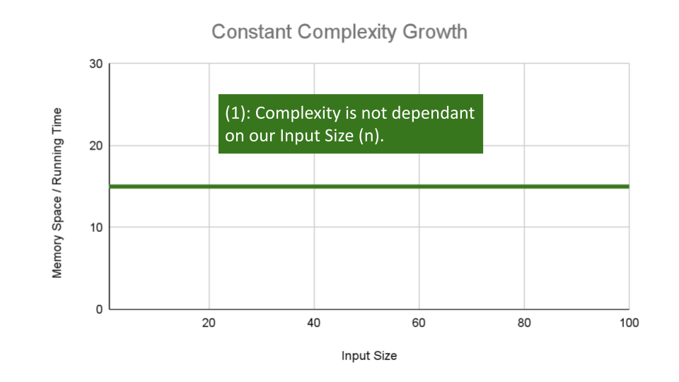

# Big O

## What is the Big O ?

Big O(oh) notation is used to describe the efficiency of an algorithm or function.

- This efficiency is evaluated based on 2 factors:

1. Running Time (also known as time efficiency / complexity)
    - The amount of time a function needs to complete.

2. Memory Space (also known as space efficiency / complexity)
   - The amount of memory resources a function uses to store data and instructions.

   ---

## Big O Overview

Big O’s role in algorithm efficiency is to describe the Worst Case of efficiency an algorithm can have in performing it’s job. It specifically looks at the factors mentioned above, which we often refer to as Space and Time.

### How to find Big O ?

we should consider 4 Key Areas for analysis:

1. Input Size
2. Units of Measurement
3. Orders of Growth
4. Best Case, Worst Case, and Average Case.

- Input Size :- Input Size refers to the size of the parameter values that are read by the algorithm.

  - We will use the letter ( n ) to refer to the Input Size value.
  - The higher this number, the more likely there will be an increase to Running Time and Memory Space.

- Units of Measurement :-  Use to evaluate a function for Time and Space complexity.

## How we  quantify the Running Time ?

We use these measuremets of time :-

1. The time in milliseconds from the start of a function execution until it ends.

   <!-- - For the purposes of Big O, we won’t be considering this measurement since different machines will have different individual run times depending on how powerful they are. Regardless, this will always be a measurement of run-time. -->

2. The number of operations that are executed.

   <!-- - Think of this as the number of lines of code that are executed from start to finish of a function. -->

3. The number of “Basic Operations” that are executed.

   <!-- - “Basic Operation” refers to the operation that is contributing the most to the total running time. This is usually the most time consuming operation within the inner most loop. -->

   ---

We use these measuremets of space :-

1. The amount of space needed to hold the code for the algorithm.

    <!-- - Think of this as the number of bytes required to store the characters for the instructions specified in your function. -->

2. The amount of space needed to hold the input data.

<!-- 
    - If direct input data is not considered, we may just refer to this as Additional Memory Space since not all functions have direct input values. -->

3. The amount of space needed for the output data.

4. The amount of space needed to hold working space during the calculation.

    - Working Space can be thought of as the creation of variables and reference points as our function performs calculations. This will also include Stack Space of recursive function calls … specifically how memory usage scales relatively with the size of the input.

---

- Orders of Growth:- We can describe overall efficiency by using the input size n and measuring the overall Units of Space and Time required for the given input size n. As the value of n grows, the Order of Growth represents the increase in Running Time or Memory Space.

     The above table plots an Order of Growth for space and time to a given value n, with the very first column representing the size of n. Each row cell contains the value for Running Time or Memory Space. Depending on which factor you are analyzing.

- Each of these notations represents the relationship our Complexity factor has when compared to input size n. We can use a line chart to better see how ‘n’ effects our space and time efficiency:

- Constant Complexity means that no matter what inputs are thrown at our algorithm, it always uses the same amount of time or space. The number (1) is used to represent a constant value. The actual number of units will most likely be greater than (1), we round this number down to (1) to represent our estimate of complexity that is independant of ( n ).
