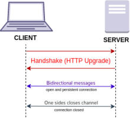

# Socket.io

## What is a Web Socket?

WebSocket is a computer communications protocol, providing full-duplex communication channels over a single TCP connection. The WebSocket protocol was standardized by the IETF as RFC 6455 in 2011.

## Web Socket request/response handshake and what happens once the connection is established

WebSocket is distinct from HTTP. Both protocols are located at layer 7 in the OSI model and depend on TCP at layer 4. Although they are different, RFC 6455 states that WebSocket "is designed to work over HTTP ports 443 and 80 as well as to support HTTP proxies and intermediaries", thus making it compatible with HTTP. To achieve compatibility, the WebSocket handshake uses the HTTP Upgrade header to change from the HTTP protocol to the WebSocket protocol.

## When would you use WebSockets?

When you built real time applications, like Group chat Room, video conferencing, multiplayer games etc. If you want server to push data by itself without calling from client.
