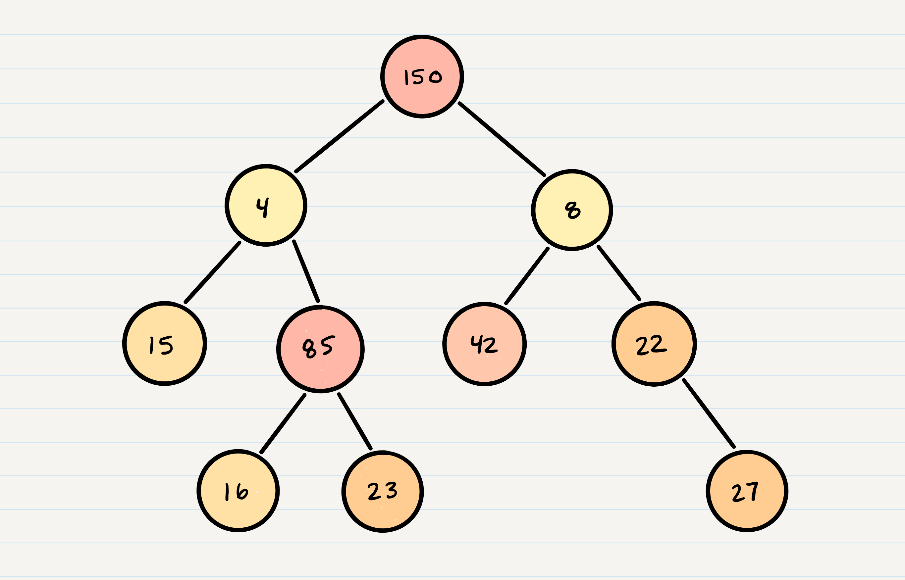

# Trees

- Common Terminology
  - Node - A Tree node is a component which may contain its own values, and references to other nodes
   - Root - The root is the node at the beginning of the tree
    -K - A number that specifies the maximum number of children any node may have in a k-ary tree. In a binary tree, k =2.
    - Left - A reference to one child node, in a binary tree
   - Right - A reference to the other child node, in a binary tree
    - Edge - The edge in a tree is the link between a parent and child node
    - Leaf - A leaf is a node that does not have any children
    - Height - The height of a tree is the number of edges from the root to the furthest leaf

## Sample Tree


## Traversals:-

An important aspect of trees is how to traverse them. Traversing a tree allows us to search for a node, print out the contents of a tree, and much more! There are two categories of traversals when it comes to trees:

- Depth First : Depth first traversal is where we prioritize going through the depth (height) of the tree first. There are multiple ways to carry out depth first traversal, and each method changes the order in which we search/print the root. Here are three methods for depth first traversal:

    - Pre-order: root >> left >> right
    - In-order: left >> root >> right
    - Post-order: left >> right >> root


- Given the sample tree above, our traversals would result in different paths:

    - Pre-order: A, B, D, E, C, F
    - In-order: D, B, E, A, F, C
    - Post-order: D, E, B, F, C, A

- pseudocode for Pre-order:

```js
ALGORITHM preOrder(root)

  OUTPUT <-- root.value

  if root.left is not NULL
      preOrder(root.left)

  if root.right is not NULL
      preOrder(root.right)
```

- It’s important to note a few things that are about to happen:

The program will look for both a root.left and a root.right. Both will return null, so it will end the execution of that method call
D will pop off of the call stack and the root will be reassigned back to B
This is the heart of recursion: when we complete a function call, we pop it off the stack and are able to continue execution through the previous function call

- pseudocode for In-order:

```js
ALGORITHM inOrder(root)
// INPUT <-- root node
// OUTPUT <-- in-order output of tree node's values

    if root.left is not NULL
        inOrder(root.left)

    OUTPUT <-- root.value

    if root.right is not NULL
        inOrder(root.right)
```

- pseudocode for Post-order:

```js
ALGORITHM postOrder(root)
// INPUT <-- root node
// OUTPUT <-- post-order output of tree node's values

    if root.left is not NULL
        postOrder(root.left)

    if root.right is not NULL
        postOrder(root.right)

    OUTPUT <-- root.value
```

- pseudocode for built-in queue to implement a breadth first traversal:

```js
ALGORITHM breadthFirst(root)
// INPUT  <-- root node
// OUTPUT <-- front node of queue to console

  Queue breadth <-- new Queue()
  breadth.enqueue(root)

  while ! breadth.is_empty()
    node front = breadth.dequeue()
    OUTPUT <-- front.value

    if front.left is not NULL
      breadth.enqueue(front.left)

    if front.right is not NULL
      breadth.enqueue(front.right)
```

## Binary Tree Vs K-ary Trees

- Binary Tree : rees can have any number of children per node, but Binary Trees restrict the number of children to two (hence our left and right children).



- K-ary Trees : Traversing a K-ary tree requires a similar approach to the breadth first traversal.


- pseudocode for  K-ary Trees :

```js
ALGORITHM breadthFirst(root)
// INPUT  <-- root node
// OUTPUT <-- front node of queue to console

  Queue breadth <-- new Queue()
  breadth.enqueue(root)

  while ! breadth.is_empty()
    node front = breadth.dequeue()
    OUTPUT <-- front.value

    for child in front.children
        breadth.enqueue(child)
```

## Big O

- The Big O time complexity for : inserting a new node is O(n). Searching for a specific node will also be O(n). Because of the lack of organizational structure in a Binary Tree, the worst case for most operations will involve traversing the entire tree. If we assume that a tree has n nodes, then in the worst case we will have to look at n items, hence the O(n) complexity.

- The Big O space complexity for : a node insertion using breadth first insertion will be O(w), where w is the largest width of the tree. For example, in the above tree, w is 4.

- A “perfect” binary tree is one where every non-leaf node has exactly two children. The maximum width for a perfect binary tree, is 2^(h-1), where h is the height of the tree. Height can be calculated as log n, where n is the number of nodes.

## Binary Search Trees

A Binary Search Tree (BST) is a type of tree that does have some structure attached to it. In a BST, nodes are organized in a manner where all values that are smaller than the root are placed to the left, and all values that are larger than the root are placed to the right.


- why Searching a BST can be done quickly :

    - because all you do is compare the node you are searching for against the root of the tree or sub-tree. If the value is smaller, you only traverse the left side. If the value is larger, you only traverse the right side.

Ex :
 Let’s say we are searching 15. We start by comparing the value 15 to the value of the root, 23.

15 < 23, so we traverse the left side of the tree. We then treat 8 as our new “root” to compare against.

15 > 8, so we traverse the right side. 16 is our new root.

15 < 16, so we traverse the left side. And aha! 15 is our new root and also a match with what we were searching for.

- The best way to approach a BST search is with a while loop. We cycle through the while loop until we hit a leaf, or until we reach a match with what we’re searching for.

- Big O :

The Big O time complexity of a Binary Search Tree’s insertion and search operations is O(h), or O(height). In the worst case, we will have to search all the way down to a leaf, which will require searching through as many nodes as the tree is tall. In a balanced (or “perfect”) tree, the height of the tree is log(n). In an unbalanced tree, the worst case height of the tree is n.

The Big O space complexity of a BST search would be O(1). During a search, we are not allocating any additional space.
