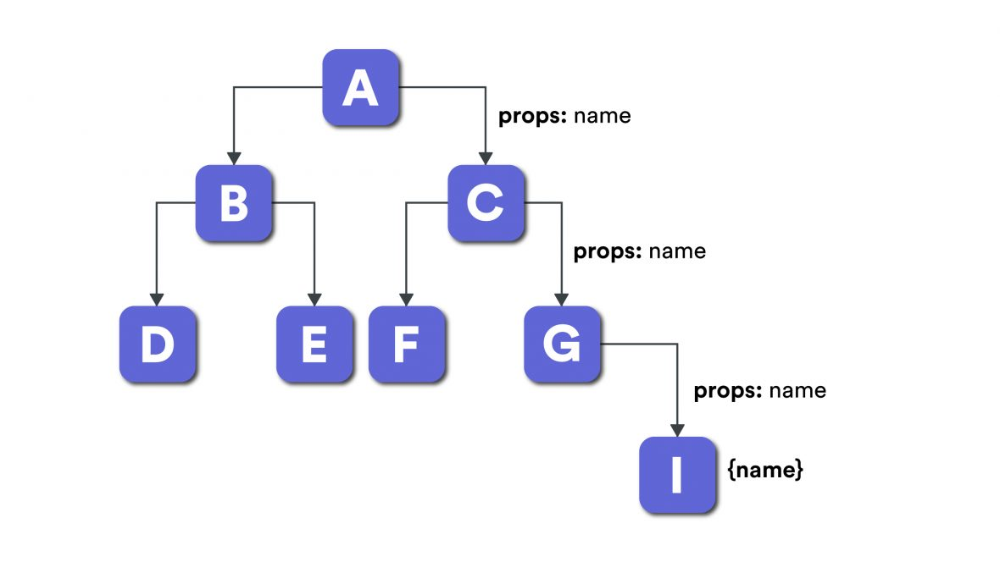
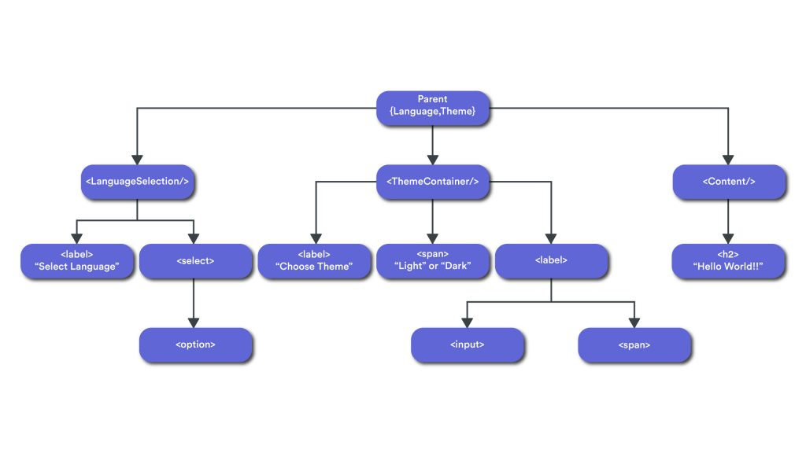

# Context API

## What is React’s context API?

According to React docs, “Context provides a way to pass data through the component tree without having to pass props down manually at every level.”

This means Context API helps us to skip the mandatory hierarchy of passing props for each component in its component tree.

## Provider pattern and Context API
Provider pattern, however, is not only about react context. You might have used a state management library like redux and mobX. Here provider is the top most component and it is provided by react-redux. We write it the following way:

```JS
import React from 'react';
import ReactDOM from 'react-dom';
import { Provider } from 'react-redux';
import store from './store';
import App from './App';

const rootElement = document.getElementById('root');
ReactDOM.render(  
   <Provider store={store}>    
     <App />  
   </Provider>,  
   rootElement
);
```

In fact, react-redux has implemented the provider pattern where Provider component receives the state as props, and post that, each child component has implicit access to the managed state.



For example, in the image above, we have component A. Here we have a prop called “name”. We need this to use in component I. For this, we need to send the same props to several layers. If the components Cand G don’t need the prop “name” then we shouldn’t expose this data to them. We need to have something so that I can access the data directly without revealing it to all other components.

To solve this problem, we would need a global object to which components can have direct access in the react tree. React’s context API has implemented the provider pattern exactly for this use case. The provider consumer relation is very handy in this context. Provider can provide the data/ API which can be consumed by the consumers.

Context API is not the only solution to the above problem. Please go through this link to see how well thought out design can solve such problems.

## Where can you use Context API?

Some sample use cases where the Context API proves helpful are:

- Theming — Pass down app theme
- i18n — Pass down translation messages
- Authentication — Pass down current authenticated user
Let’s now dig into a real-world example applying all that we learnt about the provider pattern and context API.

Building an app using provider pattern and context API
1. Explaining the different parts of the application
In this example, we intend to change the theme and perform translation basis the selected language.

We have the following components:

 1. (LanguageSelection) – Has a label “Select Language” and a drop down which has a list of languages.
    2. (ThemeContainer) – Has a label “Change Theme”, theme type and a toggle button.
    3. (Content) – Simply shows the content “Hello world!!”.
We have three languages – English, French and Spanish. The text on the screen should change to the respective language basis your selection.

There are two themes, light and dark – you can toggle it using the button. It will also show the selected theme.

2. Document Tree

We can imagine the tree like this:



Parent component is nothing but the provider which has language and theme in the state. It also has APIs(methods) to change the language and theme. Given this, all child components can consume the data and API directly.

3. (AppProvider)

```js
import React, { createContext } from "react";
import { getLocaleCode, getlocaleByCode } from "./data";
import AppContext from "./appContext";

class AppProvider extends React.Component {
 state = {
   localeCodes: [],
   localeObj: null,
   theme: "light"
 };

 updateLocalCode = async e => {
 try {
   const localeObj = await getlocaleByCode(e.target.value);
   this.setState({ localeObj });
 } catch (err) {
   console.log(err);
 }
};

updateTheme = e => {
  this.setState({ theme: e.target.checked ? "dark" : "light" });
};

render() {
  return (
    <AppContext.Provider
       value={{
         state: this.state,
         updateLocale: this.updateLocalCode,
         updateTheme: this.updateTheme
       }}
     >
     <div className={this.state.theme}>{this.props.children}</div
    </AppContext.Provider>
 );
}

componentDidMount = async () => {
 try {
   const localeCodes = await getLocaleCode();
   const localeObj = await getlocaleByCode();
   this.setState({ localeCodes, localeObj });
  } catch (err) {
     console.log(err);
  }
};
}
export default AppProvider;
```

As you can see, in this component, we are exposing the states, “updateLocale” and “updateTheme”. In the states, we have all the data which is shown in the UI whereas “updateLocale” and “updateTheme” are the callbacks which are going to be used by the consumers. Here “updateLocale” holds the definition of updateLocaleCode method – its job is to change the language. “updateTheme” holds the definition of the method “updateTheme” which toggles the theme to light or dark.

4. Let’s quickly check the render of all the three components
A. LanguageSelection
```js
render() {
 return (
   <AppContext.Consumer>
     {context => (
       <div className="haveMargin">
         <label className="labels">
           {context.state.localeObj.languageLabel}
         </label>
         <select
           value={context.state.localeObj.locale}
           onChange={context.updateLocale}
          >
             <option value="en-US">English</option>
             <option value="fr-FR">French</option>
             <option value="es-ES">Spanish</option>
           </select>
       </div>
    )}
    </AppContext.Consumer>
 );
}
```

We are using render props and accessing the data using {context.state.localObj.languageLabel}. Also, on changing the selection, we invoke the callback using {context.updateLocale}.

  For an in-depth introduction, you can refer my blog on render props.  

B. ThemeContainer

```js
render() {
 return (
   <AppContext.Consumer>
     {context => (
       <div className="haveMargin">
         <label className="labels">
           {context.state.localeObj.themeLabel}:
         </label>
         ............
         <label className="switch">
          <input type="checkbox" onChange={context.updateTheme} /
          <span className="slider round" />
         </label>
       </div>
     )}
   </AppContext.Consumer>
 );
}
```

C. Content

```js
render() {
 return (
   <AppContext.Consumer>
     {context => (
       <h2>{context.state.localeObj.content}</h2>
     )}
   </AppContext.Consumer>
 );
}
```

We access the data in ThemeContainer and Content while we invoke the callback {context.updateTheme} basis the toggle button in ThemeContainer.
