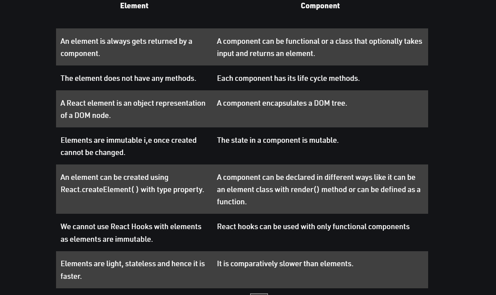

# React

## What are the building blocks of a React app?

 elements and components.

## What is the difference between an element and a React component?

- React Element : It is the basic building block in a react application, it is an object representation of a virtual DOM node. React Element contains both type and property. It may contain other Elements in its props. React Element does not have any methods, making it light and faster to render than components.

- React Component: It is independent and reusable. It returns the virtual DOM of the element. One may or may not pass any parameter while creating a component.



## What is JSX and why do we use it?

it is a syntax extension to JavaScript.We recommend using it with React to describe what the UI should look like.

## Describe the process of embedding JavaScript expressions in JSX

```js
function formatName(user) {
  return user.firstName + ' ' + user.lastName;
}

const user = {
  firstName: 'Harper',
  lastName: 'Perez'
};

const element = (
  <h1>
    Hello, {formatName(user)}!
  </h1>
);
```

## Is it safe to embed user input in JSX? Explain

By default, React DOM escapes any values embedded in JSX before rendering them. Thus it ensures that you can never inject anything that’s not explicitly written in your application. Everything is converted to a string before being rendered. This helps prevent XSS (cross-site-scripting) attacks.

## Describe mutability and React Components, specifically, how is the UI updated?

React elements are immutable. Once you create an element, you can’t change its children or attributes. An element is like a single frame in a movie: it represents the UI at a certain point in time.

With our knowledge so far, the only way to update the UI is to create a new element, and pass it to root.render().

## If changes are made to the UI, what does React update?

React DOM compares the element and its children to the previous one, and only applies the DOM updates necessary to bring the DOM to the desired state.
